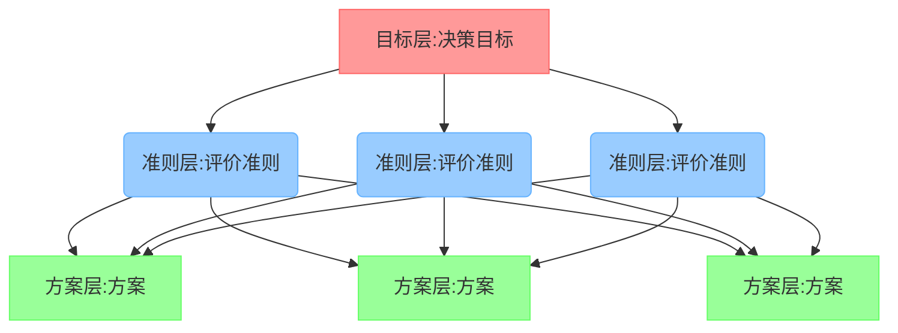

# 层次分析法

## 什么是层次分析法

`层次分析法`是通过相互比较确定标准对于目标的影响，和各个方案对于每一个准则的`权重`。这些权重在人的思维中通常是定性的，而层次分析法是要给出得到权重的`定量方法`。

## 实行步骤

根据评价准则建立分析矩阵

首先需要确定你的评价指标

| 尺度 $a_{ij}$                        | 含义                                           |
| ------------------------------------ | ---------------------------------------------- |
| 1                                    | $c_i$和$c_j$的影响相同                        |
| 3                                    | $c_i$和$c_j$的影响稍强                        |
| 5                                    | $c_i$和$c_j$的影响强                          |
| 7                                    | $c_i$和$c_j$的影响明显的强                    |
| 9                                    | $c_i$和$c_j$的影响绝对强                      |
| 2,4,6,8                              | $c_i$和$c_j$的影响之比在上述                   |
| 1，$\frac{1}{2}$,··· ，$\frac{1}{9}$ | $c_i$和$c_j$的影响之比是为上面$a_{ij}$的互反数 |

然后确定自己的分析矩阵

| |景色|花费|饮食|男女比例|
| --- | --- | --- | --- | --- |
|景色|1|1/2|4|3|
|花费|2|1|5|5|
|饮食|1/4|1/5|1|1/4|
|男女比列|1/3|1/5|4|1|

第i行第j列的元素重要程度记为$a_{ij}$

(1) $a_{ji}$表示i相较于j的重要程度。

(2)当$a_{ij}>0,A{ij}\times a_{ji}$时，称该矩阵为互反矩阵

这个矩阵就是层次分析法中的判断矩阵，通过该举证就可以得出各个评判各个指标之间的权重向量了。

> 不一致矩阵
>
> 当遇到不一致矩阵式。

对于一直矩阵

> A的致为1，A的唯一非零特征根n
>
> A的任意向量的特征根，都是对于特征根n的特征向量。
>
> ==作用：==
>
> 判断矛盾。
>
> ==一致性判断：==
>
> A的秩为1，A的根都为n，且唯一，任意A的向量都是对n的特征向量。
>
> `当不一致时`：$\lambda _{max} > n,\lambda - n \nearrow$不一致性越强
>
> 检测方法
> $$
> CI = \frac{\lambda _{max} - n}{n - 1}
> $$
> 随机一致性指标RI
> $$
> RI = \frac{CI_1 + CI_2 + ... + CI_{500}}{500} =\frac{ \frac{\lambda _1 + \lambda _2 +... + \lambda _{500}}{500} -n}{n-1}
> $$
> 一致性比：
> $$
> CR = \frac {CI}{RI}
> $$
> $CR < 0.1$可以接受，否则，提高$\lambda _{max}$的整数倍调整到满足$CR < 0.1$

==权重计算==

一致：归一化值$\rightarrow$权重

不一致：计算每一列权重，求出算数平均值$\rightarrow$ 权重

算数平均的论文表达：

对于判断 
$$
A = \begin{bmatrix}
  a_{11}&a_{12}&... &a_{1n} \\
  a_{21}&a_{22}&... &a_{2n} \\
  ... & ... & ... & ... \\
  a_{n1}&a_{n2}&... &a_{nn}
\end{bmatrix}
$$
将其归一化，再将归一化矩阵按照列相加，并将每一个元素除以n得到权重向量，即
$$
w_1 = \frac{1}{n}\sum^{n}_{j=1}\frac{a_{ij}}{\sum^n_{k=1}a_{kj}}(i = 1,2,3...,n)
$$
特征执法求权重:
$$
A = \begin{bmatrix}
1&2&5 \\
\frac{1}{2}&1&2 \\
\frac{1}{5}&\frac{1}{2}&1
\end{bmatrix}
\xrightarrow[特征向量]{计算特征值} \lambda _1= 3.0055,\lambda _2=0.0028
\overset{一致性检验}{\rightarrow} CI = 0.0053 < 0.1
\xrightarrow[最大特征向量]{最大特征值} \alpha = \begin{pmatrix}
  -0.8502 \\
  -0.4132\\
  -0.1918
\end{pmatrix}
\overset{归一化}{\rightarrow}
w=\begin{pmatrix}
0.5954 \\
0.2764 \\
0.1283
\end{pmatrix}
$$
分别统计每个权重的计算结果

| |权重|苏杭|北戴河|桂林|
| --- | --- | --- | --- | ---|
| 景色 |0.2910|0.5954|0.2764|0.1283|
| 花费 |0.5022|0.4434|0.3874|0.1692|
| 饮食 |0.0648|0.5396|0.2790|0.1634|
| 男女比例 |0.1422|0.6267|0.2797|0.0936|

根据权重表，确定权重重要性

根据权重，计算权重结果。

|          | 权重   | 苏杭   | 北戴河 | 桂林   | CI     | CR/$\lambda$  |
| -------- | ------ | ------ | ------ | ------ | ------ | ------------- |
| 景色     | 0.2910 | 0.5954 | 0.2764 | 0.1283 | 0.0028 | 0.0053/3.0055 |
| 花费     | 0.5022 | 0.4434 | 0.3874 | 0.1692 | 0.0091 | 0.0176/3.0183 |
| 饮食     | 0.0648 | 0.5396 | 0.2970 | 0.1634 | 0.0064 | 0.0088/3.0092 |
| 男女比例 | 0.1420 | 0.6267 | 0.2797 | 0.0936 | 0.0429 | 0.0825/3.0858 |
| 最终得分 |        | 0.5199 | 0.3339 | 0.1462 |        |               |

苏杭最终得分=$a_1 \times b_1 + a_2 \times b_2 + a_3 \times b_3 + a_4 \times b_4 =0.5199$

检验一致性：
$$
CR = \frac{a_1 CI_1 + a_2 CI_2 + ... + a_m CI_m}{a_1RI_1+a_2RI_2+...+a_mRI_m} = 0.0203 < 0.1
$$
通过检验，结果正确。

## 层次分析法

用于解决评价类问题

需要绘制出结构图（目标，准则，方案）

`构造判断矩阵（评价指标权）`

依照指标打分

求权重得分

一致性检验

